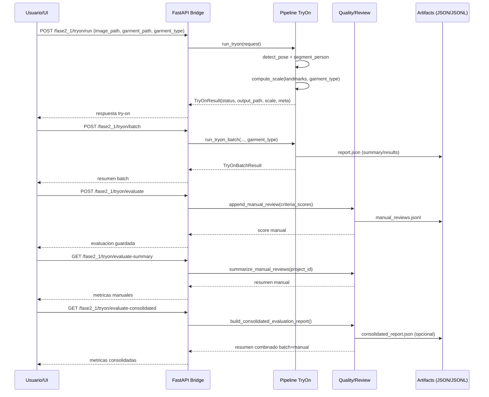
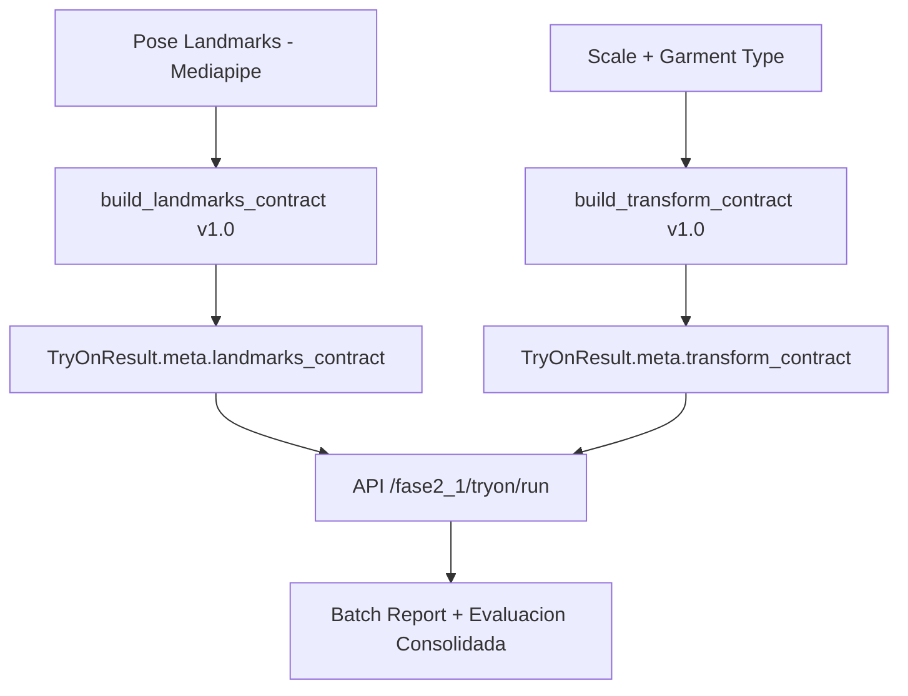

# FASE 2 - Virtual Try-On

## Objetivo

Extender Fabric2Mesh AI para permitir:

- Superponer una prenda sobre una persona en imagen.
- Dejar la base lista para video o secuencia de frames.
- Ajustar automáticamente la prenda al cuerpo usando IA.
- Reutilizar modelos texturizados y assets creados en Fase 1.
- Mantenernos en herramientas gratuitas, open source y entrenables.

---

## Estado actual (arranque 2.1)

Avance implementado en esta rama de trabajo:

1. Carpeta aislada de fase: `fase2_1/`.
2. Módulo baseline de try-on en `fase2_1/core/tryon/`.
3. API dedicada de fase en `fase2_1/api/main.py`.
4. Endpoint puente en API principal: `POST /fase2_1/tryon/run`.
5. Test de contrato del endpoint: `tests/test_fase2_1_api.py`.
6. Script de evaluación batch: `fase2_1/scripts/evaluate_batch.py`.
7. Configuración versionada de inferencia: `fase2_1/config/inference.yaml`.
8. Checklist de calidad visual: `fase2_1/config/quality_checklist.json`.

Comandos rápidos:

```bash
# API separada de fase 2.1
uvicorn fase2_1.api.main:app --host 0.0.0.0 --port 8010 --reload

# API principal con endpoint puente
uvicorn apps.api.main:app --host 0.0.0.0 --port 8000 --reload

# Test de Fase 2.1
python -m pytest -q tests/test_fase2_1_api.py

# Evaluación batch (baseline)
python fase2_1/scripts/evaluate_batch.py \
   --input-dir data/raw/personas \
   --garment-path data/raw/models/TShirts.obj \
   --garment-type shirt
```

---

## Secuencia de trabajo del sistema (2.1)



## Contrato canonico de landmarks y transforms

El pipeline de `run` y `batch` devuelve en `meta` dos bloques versionados:

- `landmarks_contract`: puntos clave en espacio normalizado (`image_normalized`).
- `transform_contract`: parametros de transformacion de prenda (escala, rotacion, traslacion).

Version actual: `1.0`.



---

## Criterio técnico de esta fase

En esta fase conviene evitar dos errores:

- Intentar simulación física completa desde el inicio.
- Depender de servicios cerrados o pipelines difíciles de entrenar localmente.

La estrategia correcta para Fase 2 es:

1. Resolver primero un try-on robusto en imagen estática.
2. Introducir IA entrenable en pose, segmentación y ajuste.
3. Añadir oclusión, máscara y composición limpia antes de pensar en tela física realista.
4. Recién después pasar a video y deformación más avanzada.

---

## Enfoque recomendado

### Arquitectura propuesta

```text
Foto de persona
   ↓
Pose estimation
   ↓
Segmentación / parsing de cuerpo
   ↓
Cálculo de escala, rotación y anclajes
   ↓
Warp / alineación de la prenda
   ↓
Composición con oclusión
   ↓
Imagen final
```

### Qué sí hacemos

- Ajuste geométrico de la prenda.
- Estimación de puntos clave del cuerpo.
- Segmentación del cuerpo o de la ropa existente.
- Composición final con máscaras.
- Entrenamiento de componentes propios con datasets abiertos.

### Qué no hacemos todavía

- Simulación física avanzada de tela.
- Reconstrucción completa de cuerpo 3D.
- Cloth dynamics en tiempo real.

---

## Mejora clave sobre el plan inicial

El documento anterior planteaba un overlay demasiado simple.

Eso sirve para un demo técnico, pero no para un try-on mínimamente usable, porque faltaban tres piezas críticas:

1. Segmentación del cuerpo y la ropa.
2. Manejo de oclusiones.
3. Componentes entrenables reales más allá de MediaPipe.

La versión corregida de Fase 2 propone un MVP más serio sin salirnos de herramientas gratuitas.

---

## Stack recomendado con herramientas gratuitas

### IA / visión por computadora

- PyTorch
- OpenCV
- NumPy
- MediaPipe
- torchvision
- albumentations

### Modelos open source entrenables

- RTMPose o MMPose para pose entrenable.
- YOLOv8-seg o Detectron2 para segmentación.
- U2Net o MODNet si se necesita recorte de silueta.
- Segment Anything solo como apoyo, no como núcleo entrenable principal.

### 3D y render

- Blender
- trimesh
- Three.js
- GLTF / GLB

### Backend

- FastAPI

### Entrenamiento

- PyTorch Lightning opcional.
- MLflow ya presente en el proyecto para experiment tracking.

---

## Datasets gratuitos recomendados

### Para ropa y landmarks

- DeepFashion2
  - categorías
  - bounding boxes
  - landmarks
  - masks

### Para parsing corporal o segmentación humana

- LIP
- ATR
- CIHP

### Para robustecer el sistema

- Datos propios generados por ustedes:
  - renders sintéticos desde Blender
  - fotos reales de usuario con poses controladas
  - pares prenda-persona para calibración

---

## Componentes IA que sí conviene entrenar

## 1. Pose del cuerpo

### Baseline gratuito

- MediaPipe Pose

### Mejora entrenable

- MMPose o RTMPose fine-tuned con datos de ropa y poses objetivo.

### Por qué

MediaPipe sirve para arrancar, pero no está pensado para tunear fino a tu dominio. Si el objetivo es usar IA y entrenamiento real, conviene mover el pose a un stack entrenable.

---

## 2. Segmentación de persona y oclusión

### Recomendado

- YOLOv8-seg o Detectron2 entrenado o fine-tuned con máscaras de ropa y cuerpo.

### Por qué

Sin segmentación, el overlay se ve falso. La oclusión correcta es lo que hace que una manga, cabello o brazo tapen parte de la prenda cuando corresponde.

---

## 3. Alineación y warp de la prenda

### MVP

- ajuste por hombros, torso, cadera y bounding boxes.

### Mejora entrenable

- red pequeña de regresión para parámetros de transformación:
  - escala
  - traslación
  - rotación
  - deformación simple

### Objetivo

No aprender una prenda nueva, sino aprender a colocar mejor una prenda existente.

---

## 4. Composición final

### MVP

- alpha blending con máscara.

### Mejora

- orden de capas:
  - fondo
  - cuerpo
  - prenda virtual
  - regiones ocluyentes como brazos, cabello o ropa original

---

## Pipeline recomendado de Fase 2

## MVP usable

1. Usuario sube foto.
2. Detectar pose.
3. Segmentar cuerpo.
4. Obtener anclas: hombros, torso, cadera.
5. Escalar y posicionar la prenda.
6. Aplicar warp simple.
7. Componer con máscara y oclusión.
8. Devolver imagen final.

## Versión mejorada

1. Pose entrenable.
2. Segmentación entrenada.
3. Estimación de parámetros de ajuste con red propia.
4. Refinamiento visual final.

---

## Estructura sugerida

```text
core/
├── tryon/
│   ├── pose.py
│   ├── parsing.py
│   ├── align.py
│   ├── warp.py
│   ├── occlusion.py
│   ├── overlay.py
│   ├── pipeline.py
│   └── schemas.py
├── training/
│   ├── datasets/
│   ├── pose/
│   ├── segmentation/
│   └── fit_regression/
```

Esto separa inferencia de entrenamiento, que en la versión anterior estaba demasiado básica.

---

## Ejemplo mínimo de pose

Archivo: `core/tryon/pose.py`

```python
import cv2
import mediapipe as mp

mp_pose = mp.solutions.pose


def detect_pose(image_path: str):
    image = cv2.imread(image_path)
    image_rgb = cv2.cvtColor(image, cv2.COLOR_BGR2RGB)

    with mp_pose.Pose(static_image_mode=True) as pose:
        results = pose.process(image_rgb)

    return results.pose_landmarks
```

Esto sirve como baseline, no como solución final entrenable.

---

## Ejemplo mejorado de escala

Archivo: `core/tryon/align.py`

```python
def compute_scale(landmarks):
    left_shoulder = landmarks.landmark[11]
    right_shoulder = landmarks.landmark[12]
    left_hip = landmarks.landmark[23]
    right_hip = landmarks.landmark[24]

    shoulder_width = abs(left_shoulder.x - right_shoulder.x)
    torso_width = abs(left_hip.x - right_hip.x)

    return max(shoulder_width, torso_width) * 2.2
```

Mejora respecto a la versión anterior porque no depende solo de hombros.

---

## Ejemplo de overlay utilizable

Archivo: `core/tryon/overlay.py`

```python
import cv2
import numpy as np


def alpha_overlay(background, overlay_rgba, x, y):
    h, w = overlay_rgba.shape[:2]
    roi = background[y:y+h, x:x+w]

    rgb = overlay_rgba[:, :, :3]
    alpha = overlay_rgba[:, :, 3:4] / 255.0

    blended = (alpha * rgb + (1 - alpha) * roi).astype(np.uint8)
    background[y:y+h, x:x+w] = blended
    return background
```

Esto es mejor que copiar píxeles sin máscara.

---

## Integración con Three.js

### Qué debe devolver backend

- landmarks
- bounding box corporal
- escala
- rotación
- posición
- máscara o regiones de oclusión si ya están disponibles

### Qué hace el frontend

- carga modelo GLB
- ajusta transformación
- renderiza preview
- opcionalmente mezcla canvas del render con imagen original

Ejemplo:

```javascript
const loader = new THREE.GLTFLoader();

loader.load('model.glb', function (gltf) {
  const model = gltf.scene;
  model.scale.set(scale, scale, scale);
  model.position.set(x, y, z);
  model.rotation.set(rx, ry, rz);
  scene.add(model);
});
```

---

## Plan de entrenamiento realista

## Etapa A - Baseline sin entrenamiento fuerte

- MediaPipe para pose.
- Segmentación con modelo abierto preentrenado.
- Reglas geométricas para escala y posición.

Objetivo: validar pipeline visual.

## Etapa B - Entrenamiento útil

- Fine-tuning de segmentación de cuerpo y ropa.
- Fine-tuning o reemplazo de pose por MMPose o RTMPose.
- Dataset interno con ejemplos de colocación correcta.

Objetivo: mejorar precisión.

## Etapa C - Ajuste aprendido

- Entrenar un modelo pequeño para predecir parámetros de transformación.

Input sugerido:

- landmarks
- máscara corporal
- categoría de prenda

Output sugerido:

- escala
- desplazamiento x/y
- rotación
- deformación ligera

---

## Video y semi-tiempo real

Esto sí es viable, pero no como primer entregable.

Orden correcto:

1. Imagen estática robusta.
2. Lote de imágenes.
3. Video por frames.
4. Optimización de inferencia.

Pipeline futuro:

```text
Video
   ↓
Frames
   ↓
Pose por frame
   ↓
Tracking temporal
   ↓
Actualizar prenda
   ↓
Render
```

La pieza extra aquí es tracking temporal para evitar jitter.

---

## Limitaciones reales de Fase 2

- No habrá simulación física de tela realista todavía.
- Las poses extremas van a degradar el resultado.
- La calidad depende mucho de segmentación y landmarks.
- La prenda no va a caer físicamente sobre el cuerpo.

Eso es aceptable para esta fase si el objetivo es demostrar un try-on funcional con IA.

---

## Buenas prácticas

- Usar GLB como formato frontend.
- Normalizar escala y orientación de prendas en Blender.
- Mantener texturas entre 1K y 2K para evitar sobrecarga.
- Entrenar primero con una sola categoría, por ejemplo tops o camisas.
- Medir todo con ejemplos propios, no solo con dataset público.

---

## Recomendación concreta para este proyecto

Si el objetivo es mantenernos en gratis + IA + entrenamiento, la mejor ruta es:

1. Baseline con MediaPipe + segmentación open source.
2. Integrar DeepFashion2 solo como fuente de labels 2D, no como fuente de modelos 3D.
3. Entrenar segmentación de ropa y persona con dataset abierto y datos propios.
4. Entrenar un módulo pequeño de ajuste geométrico.
5. Dejar simulación física para Fase 3 o posterior.

Ese camino sí es viable en este repositorio y sí aprovecha IA entrenable de verdad.

---

## Resultado esperado de Fase 2

```text
Usuario sube foto
Selecciona una prenda
Sistema detecta pose y cuerpo
Sistema ajusta prenda
Sistema compone la imagen final
Resultado visual funcional y repetible
```

---

## Conclusión

- Es viable hacerlo con herramientas gratuitas.
- Sí se puede incorporar IA entrenable real en esta fase.
- La clave no es una simulación compleja, sino pose + segmentación + alineación + composición.
- El MVP debe apuntar a calidad visual consistente, no a realismo físico total.

---

## FASE 2.1 - Inicio inmediato (MVP ejecutable)

Objetivo de 2.1: dejar una primera versión funcional de try-on en imagen estática, medible y repetible.

### Alcance de 2.1

Incluye:

1. Endpoint de inferencia para try-on en imagen.
2. Pipeline base con:
   - pose
   - segmentación
   - alineación geométrica
   - overlay con alpha
3. Estructura de entrenamiento preparada para:
   - segmentación
   - ajuste geométrico
4. Métricas iniciales y registro de experimentos.

No incluye todavía:

1. Video tiempo real de producción.
2. Simulación física de tela.
3. Deformación compleja de malla con física.

### Entregables de 2.1

1. API try-on para imagen estática.
2. Primer módulo core/tryon integrado al proyecto.
3. Plan de entrenamiento incremental con datasets gratuitos.
4. Checklist de validación visual con casos controlados.

### KPI iniciales de 2.1

1. Tiempo por imagen menor o igual a 2.5 segundos en modo CPU baseline.
2. Tasa de overlays válidos mayor o igual a 90 por ciento en dataset de prueba interna.
3. Reducción visible de errores de alineación frente al baseline simple.